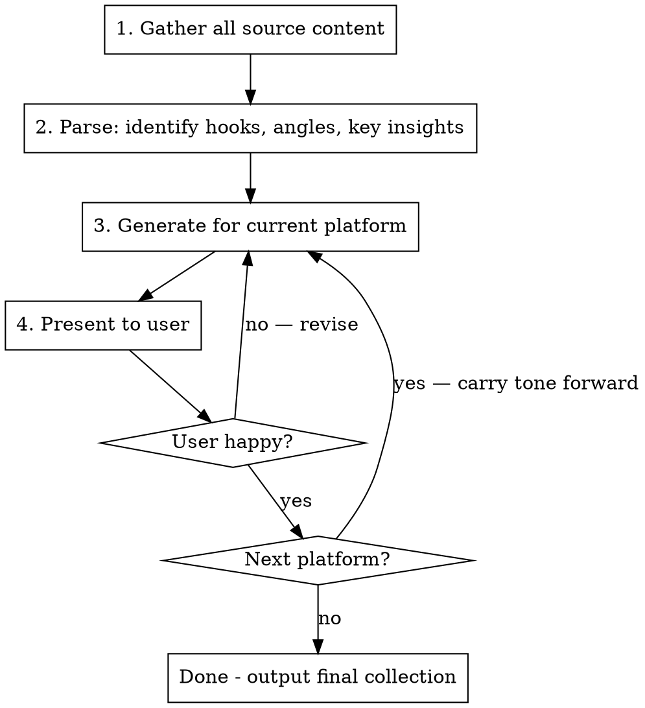

# Generate Social Media

Create authentic, platform-optimized social media posts from source content (blog posts, podcast episodes, show notes, rough drafts, etc.). Works platform-by-platform with user iteration.

## Workflow



### Step 1: Gather Content

**If the user has NOT provided content alongside the request, you MUST prompt for it before proceeding.** Use AskUserQuestion or direct questions to collect:

1. **Source material** (required) — "What content are we promoting? Share the file path, URL, or paste the text."
   - Blog post, show notes, episode file, announcement, etc.
2. **Supporting context** (required) — "Any rough notes, bullet points, or additional context beyond the main content?"
   - Google Docs, prep notes, talking points, etc.
3. **Target URL** (required) — "What URL should the posts link to?"
4. **Tone reference** (optional) — "Any previous posts I should match the tone of? Share a link or example."
5. **Specific hooks or angles** (optional) — "Anything timely or specific you want to lean into? A trending topic, a recent event, a particular angle?"
6. **Handles/mentions** (optional) — "Any accounts to @mention? Provide platform-specific handles."

**Do NOT generate anything until you have at least items 1-3.** Read and parse everything before generating.

### Step 2: Identify Hooks

Analyze the content for:
- **Core insight** — the one thing that makes this worth sharing
- **Timely hooks** — trending topics, current events, viral discussions the content connects to
- **Contrarian or surprising angles** — what challenges assumptions
- **Practical value** — what the audience walks away with
- **Quotable moments** — punchy lines that stand alone

### Step 3: Generate Platform-by-Platform

Process platforms in this order. For each: generate, present, iterate with user until confirmed, then move to next.

**Use the confirmed content from earlier platforms to maintain consistent messaging across all platforms.** The hook and angle should be coherent, adapted per platform — not reinvented each time.

---

## Platform Specs & Best Practices

### 1. Twitter/X

| Constraint | Value |
|-----------|-------|
| Character limit | 280 per tweet |
| Format | 2 tweets (main + reply) |
| Link placement | **NEVER in tweet 1** — URLs get algorithmically downranked |
| @mentions | Fine, no penalty. Use when relevant (can get RT from mentioned accounts) |
| Hashtags | 0-2 max. Hashtag spam hurts reach. |
| Images | Boost engagement but are optional |

**Strategy:**
- **If there's a URL to share:** Use 2 tweets. Tweet 1 is the hook (no URL, optimized for reach). Tweet 2 (reply) carries the URL + supporting detail.
- **If there's no URL:** Default to a single tweet. Only split into multiple tweets if there are genuinely distinct points worth making that don't fit in 280 chars.
- **Never put a URL in tweet 1** — it gets algorithmically downranked. URLs always go in tweet 2.

**Tone:** Conversational, opinionated, direct. Lead with an observation, question, or bold take. Avoid "NEW EPISODE" or "Check out my latest" energy.

### 2. Threads

| Constraint | Value |
|-----------|-------|
| Character limit | 500 |
| Format | Main post + reply for link |
| Link placement | **NEVER in main post** — external URLs reduce reach significantly |
| Hashtags | 2-3 max, optional |
| Images | Help with reach |

**Strategy:**
- **Post 1**: Self-contained value. Should make sense and be engaging without any link. Slightly more room than Twitter — use it for context, not filler.
- **Post 2 (reply)**: Just the link.

**Tone:** Personal, casual (Instagram DNA). More "here's what I think" than "here's what we made."

### 3. Bluesky

| Constraint | Value |
|-----------|-------|
| Character limit | 300 |
| Format | Single post |
| Link placement | **Inline is fine** — no algorithmic penalty for URLs |
| Hashtags | 0-1, community doesn't love them |
| @mentions | Use full handle format (@user.bsky.social) |

**Strategy:**
- Single post with link. The constraint is character count — 300 is tight, especially with long Bluesky handles eating characters.
- When drafting, count characters. If the user shares a version that's too long, identify specific cuts.

**Tone:** Authentic, community-oriented. Bluesky's culture rewards genuine over promotional.

### 4. LinkedIn

| Constraint | Value |
|-----------|-------|
| Character limit | 800-1200 recommended (3000 max) |
| Format | Single post with structure |
| Link placement | Bottom of post, inline is fine |
| Hashtags | 3-5 at the end can help discoverability |

**Strategy:**
- **First 2-3 lines are critical** — this is the "above the fold" content before "see more." Must hook.
- Use line breaks liberally. Dense paragraphs die on LinkedIn.
- Arrow bullets (→) or em dashes for scannable lists work well.
- Longer posts get more dwell time = algorithmic boost.

**Tone:** Professional but human. Not corporate. Think "informed peer sharing a perspective" not "thought leader broadcasting."

---

## Content Principles

- **Authentic over engagement-bait** — genuine posts that reflect real thinking
- **Catchy, not sleazy** — hooks should intrigue, not manipulate
- **No AI slop** — avoid phrases like "game-changer", "let's dive in", "here's why it matters", "hot take:", "I'm excited to announce"
- **Questions over answers** — pose challenges, don't reveal everything
- **Timely hooks when available** — connecting to trending discussions dramatically increases reach
- **Substance over hype** — focus on the actual insight, not performative excitement

## Common Mistakes

| Mistake | Fix |
|---------|-----|
| Same post copy-pasted across platforms | Adapt tone, format, and length per platform |
| URL in Twitter tweet 1 | Move URL to reply tweet |
| URL in Threads main post | Move URL to reply post |
| Bluesky post over 300 chars | Watch for long @handles eating character budget |
| LinkedIn post with no hook above fold | First 2 lines must earn the "see more" click |
| Generic "new episode!" energy | Lead with a specific insight, question, or timely hook |
| Too many hashtags | Twitter: 0-2, Threads: 2-3, Bluesky: 0-1, LinkedIn: 3-5 |
| Revealing everything in the post | Tease the value — make them click through |

## Output Format

Present each platform's content in a clearly labeled section. **You MUST include character counts** for every post on character-limited platforms so the user can verify at a glance:

```
## Twitter/X

**Tweet 1** (187/280 chars):
> [content here]

**Tweet 2 — reply** (241/280 chars):
> [content here]
```

**Before presenting any post, validate it fits within the platform's limit.** If it doesn't, cut it down before showing it to the user — don't present over-limit drafts. For Bluesky especially (300 chars), account for long @handles when counting.
